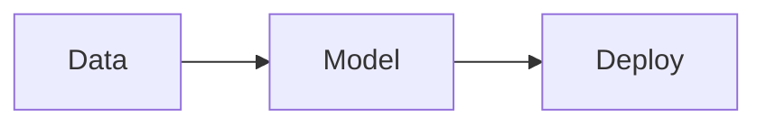

# Lecture 1: Introduction to ML

## Summary
Overview of core ML concepts.

## Graph

```mermaid
graph LR; A[Data] --> B[Model] --> C[Deploy]
```

## Video Embed
![[https://youtu.be/Gpp_NgTstGE]]

## PDF
[Download PDF](assets/Lecture1.pdf)
